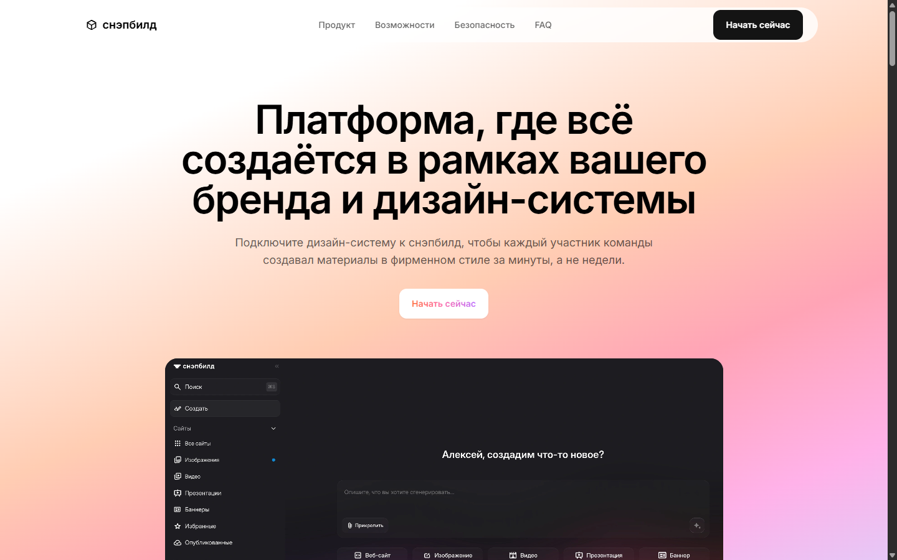

# snapbuild: test assignment (Fullstack Developer)

[Русский](README.md) · **English**

## 1. What was done

The [snapbuild](https://snapbuild.ru/) landing page is reproduced in Next.js: all 11 original sections
(header, hero, logo strip, value proposition, content format tabs, comparison,
security, roadmap, FAQ, final CTA, footer). It is extended with five new sections:
**Pricing**, **Reviews**, **Use cases**, **Integrations**, **Contact form**.
The new sections are placed in the main flow of the page between the existing blocks, rather than
put in a separate demo block at the end.



## 2. Link to the published version

https://nikolayyaroslavcev.github.io/snap/

## 3. Running locally

```bash
npm install
npm run dev
# http://localhost:3000
```

Build (static export to `out/`):

```bash
npm run build
```

Tests (Vitest, unit tests for `lib/validation.ts`):

```bash
npm test
```

## 4. Stack

Next.js 16 (App Router, static export `output: 'export'`), React 19, TypeScript,
Tailwind CSS 3.4, Vitest. No backend, no external services, no API keys.

## 5. Five new sections

1. **Use cases**: scenarios by role (marketing / design / sales / product), tabs with result cards.
2. **Reviews**: a carousel of customer quotes with dot navigation.
3. **Pricing**: 3 plans, a "month / year" toggle that recalculates the price.
4. **Integrations**: feature cards that open a modal window with details.
5. **Contact form**: validation of required fields and email format, inline errors, a successful submission state (nothing is actually sent to a server).

## 6. How the style of the original site was analyzed

Screenshots at three widths (375 / 768 / 1280) plus the real computed styles taken via
`getComputedStyle`: colors, fonts, radii, spacing, brand gradients. Nothing was judged by eye.
The tokens are moved into `tailwind.config.ts` as the single source of style:
no section hardcodes a color or radius outside the theme.

## 7. What was reproduced from the original

The header (floating, with blur on scroll), the hero with the brand gradient and an interface preview,
the client logo strip (an animated ticker), the value proposition block, the content
format tabs, the comparison table with the snapbuild column highlighted by a gradient, the security
block, the roadmap timeline, the FAQ accordion, the final CTA on a gradient background, the footer.
All 11 sections follow the original order and are built on real computed tokens, not from memory. The sections
also fade in smoothly on scroll (`IntersectionObserver`), as in the original, with support for
`prefers-reduced-motion` and a no-JS fallback.
